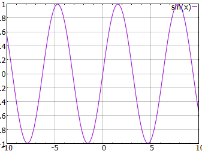
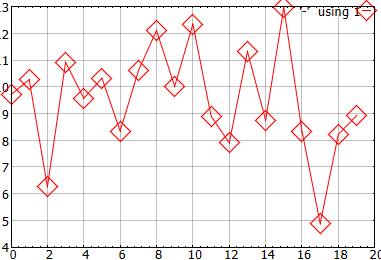

<!-- LC_NOTICE_BEGIN
===============================================================================
|                        Copyright (C) 2021 Luca Ciucci                       |
|-----------------------------------------------------------------------------|
| Important notices:                                                          |
|  - This work is distributed under the MIT license, feel free to use this    |
|   work as you wish.                                                         |
|  - Read the license file for further info.                                  |
| Written by Luca Ciucci <luca.ciucci99@gmail.com>, 2021                      |
===============================================================================
LC_NOTICE_END -->

# I don't know *C++*

The purpose of this library is to provide a simple C++ data pottibg tool using *Gnuplot*.

In some courses, for example numerical courses for physics, matematics or engineering you are taught how to implement algorithms, you can choose which language to use and many are familiar with some scripting languages like *Python*. Sometime you may want to use *C* or *C++* for various reasons, usually *C* is taught at a basic level in previous courses, but this library is in *C++*, what should you do?  
Don't warry and read this document for a very short and basic introduction.

## Keep in mind

Keep in mind that *C++* is (at a very basic level) just *C* with some cool features that help you solve problems fast, as such you can use nearly any notion you leared in *C* (with sime exceptions like there is no [VLA](https://en.wikipedia.org/wiki/Variable-length_array))

## What do I need

If you know how to compile *C code*, you probably already have the tools you need to compile *C++ code*.

On *Linux* and *Unix* like systems you probably already have *GCC* (this includes *G++*), *Clang* or some similar compilers. To follow this tutorial I suggest keeping them up to date and also install [*CMake*](https://cmake.org/download/), this tool will help us creating the projects using text files in a *"platform indipendent"* way.

On *Windows* I suggest you to use [Visual Studio](https://visualstudio.microsoft.com/) and keep it up to date, install telling it to install the desktop c++ development tools and you will be ready to go.

## Install *Gnuplot++* library

To a complete guide install and including *Gnuplot++*, read [Including](Including). Also read the [Visual Studio tutorial](VS_guide) if you want to use Visual Studio and you don't know what to do.

### `make install`

On *Linux* or *Unix*, simply open a terminal, navigate to the `gnuplotpp` folder and type:
```sh
cmake .
cmake --build .
make install
```

### Visual Studio

Open VS, *"continue without code"* and `file->open->CMake...` and open the *gnuplotpp* folder.

Edit the configuration, select `Show advanced settings` and set `Install directory` to a folder that is in the PATH

## Creating a CMake project

- Create a folder where you like, name it `tmp`
- inside it create a `CMakeLists.txt` file and a `main.cpp` file
- inside the file write:
```cmake
# project setup
# https://cmake.org/cmake/help/latest/guide/tutorial/index.html
project(
    "mySimpleProject" # the project name
    VERSION 0.0       # your project version
    DESCRIPTION "..." # your project brief description
    LANGUAGES CXX     # languages we will use (C++)
)

# create an executable target named "myProgram"
add_executable("myProgram")

# find the gnuplotpp package you have already installed
find_package(gnuplotpp REQUIRED)

# link the gnuplotpp library to our target
target_link_libraries("myProgram" PRIVATE "gnuplotpp")

# add sources to our target
target_sources("myProgram" PRIVATE "main.cpp")
```

At this point you can use the project using the methods in the previous section. For example in *Visual Studio* you can open the cmake project, select `Build->Build All` and run "myProgram.exe".

## Writing a basig code

A clasic *C++* main file looks something like this (exactly like in *C*):
```Cpp
// The "main" function works as the "entry point" of our program
int main(int argc, char** argv)
{
    return 0;
}
```

You can run this program but there will be no output. Let's write instead:
```Cpp
// This will provide us some Input/Output streams,
// it is similar to <stdio.h> in C but it is simpler to use.
// If you really want you can include <stdio.h> instead.
// This is a standart library, stuff will be in the 'std' namespace
#include <iostream>

// This will provide us the 'string' class that is very easy to use
#include <string>

int main(int argc, char** argv)
{
    // We can print data on the console using 'cout' that
    // lives in the 'std' namespace.
    // The operator '<<' pushes data into the "cout" stream.
    // The "endl" puts a "\n" and also flushes the stream like
    // 'flush()' in C
    std::cout << "Hello There!" << std::endl;

    // You can print stuff more easily:
    int myNumber = 42;
    std::cout << "My favourite number is " << myNumber << "!" << std::endl;

    // You can read user imputs like this:
    std::cout << "What's your name?" << std::endl;
    std::string yourName;
    std::cin >> yourName;
    std::cout << "What is your favourite number?" << std::endl;
    double yourNumber = 0;
    std::cin >> yourNumber;

    std::cout << yourName << "'s favourite number is " << yourNumber << std::endl;

    return 0;
}
```
Example output:
```
Hello There!
My favourite number is 42!
What's your name?
Luca
What is your favourite number?
2.71828
Luca's favourite number is 2.71828
```

## Writing a code that uses *Gnuplot++*

```cpp
#include <iostream>
#include <string>

// Include the gnuplotpp header
#include <gnuplotpp/gnuplotpp.hpp>

int main(int argc, char** argv)
{
    // Gnuplotpp is in the lc namespace. We write this line to avoid prefixing every
    // class with 'lc::' (for example 'lc::Gnuplotpp')
    using namespace lc;

    // We create a Gnuplotpp instance. This opens gnuplot and comunicates
    // using a pipe.
    // This means create an object (like a variable in C) named 'gp'
    // with class (type) Gnuplotpp.
    Gnuplotpp gp;

    // We can send command to Gnuplot like you would do in the shell (command line)
    // with the same syntax you use for cout.
    // 'endl' has the same effect of pressing "enter" on keyboard, ensuring the
    // string is actually sent to gnuplot.
    gp << "plot [-10:10] sin(x)" << std::endl;

    return 0;
```
Example of generated plot:



## Writing a bit more complex code

```Cpp
#include <iostream>

// The 'vector' class provides a more friendly way of using
// dynamically allocated arrays (in C you would use malloc/realloc/free
// but the vector class is simpler and safer)
#include <vector>

// This header provides some useful classes to generate random numbers
#include <random>

#include <gnuplotpp/gnuplotpp.hpp>

int main(int argc, char** argv)
{
    using namespace lc;

    Gnuplotpp gp;

    // Create a dynamically allocated array you can access as a regular vector
    std::vector<double> yData;

    // N will be the number of points we will plot
    constexpr int N = 20;

    // Create some objects for random number generation...

    // This is the default random engine. You can imagine it works like the
    // rand() function in C but it is MUCH BETTEr
    std::default_random_engine engine;

    // We will generate numbers distributed using the gaussian distribution
    // centered in 10 and with standard deviation (sigma) = 2
    std::normal_distribution<double> generator(10, 2);

    // We thell the vector that we will place N elements, this
    // will internally allocate space for N elements
    yData.reserve(N);

    // Add data to the vector
    for (size_t i = 0; i < N; i++)
        // generate a random point calling the generator using the
        // defualt random engine
        yData.push_back(generator(engine));

    // you can access elements like this:
    std::cout << "The third element is " << yData[2] << std::endl;

    // Now wi will prepare to plot our data...

    // The style for our plot line. If you don't want to draw the lines,
    // simply skip this two code lines
    Gnuplotpp::LineStyle lineStyle;
    lineStyle.lineColor = "red";

    // The style for our plot markers.
    Gnuplotpp::Marker markerStyle;
    markerStyle.pointType = Gnuplotpp::PointType::RhombusDot;
    markerStyle.pointSize = 3;

    // Now we create a plot:
    auto myPlot = gp.plot(
        // the first parameter for this function overload is the data
        yData,
        // now we will set some options, if you skip this lines the
        // default options would be used:
        {
            .lineStyle = lineStyle,
            .marker = markerStyle
        }
    );

    // this was a quite compact form, an explicit syntax would be:
    if constexpr (false)
    {
        Gnuplotpp::SinglePlotOptions options;
        options.lineStyle = lineStyle;
        options.marker = markerStyle;
        Gnuplotpp::Plot2d myPlot = gp.plot(yData, options);
    }

    // Nothe that if you have very simple data, you could use a simpler form:
    if constexpr (false)
    {
        // passing data explicitly
        auto myPlot = gp.plot({ 0, 1, 3, 2, 2, 1, 1, 0 });
    }

    // Finally, we actually draw the plot:
    gp.draw({ myPlot });

    // Note that you can draw multiple charts on the same plot in this way:
    // gp.draw({ myPlot1, myPlot2, myPlot3, ... });

    return 0;
}
```

Example of generated plot:



## Saving the image (TODO)
TODO

## Analyzing the output

You can redirect the output to a file so that you can see the commands that were actually given to gnuplot:
```cpp
#include <iostream>

#include <gnuplotpp/gnuplotpp.hpp>

int main(int argc, char** argv)
{
    using namespace lc;

    // In this way the output will be redirected to a file instead of gnuplot
    Gnuplotpp gp(std::ofstream("myFile.p"));

    Gnuplotpp::LineStyle lineStyle;
    lineStyle.lineColor = "red";

    Gnuplotpp::Marker markerStyle;
    markerStyle.pointType = Gnuplotpp::PointType::RhombusDot;
    markerStyle.pointSize = 3;

    auto myPlot = gp.plot({ 1, 2, 3, 4, 0 }, { .lineStyle = lineStyle, .marker = markerStyle });

    gp.draw({ myPlot });

    return 0;
}
```
Output in the `myFile.p` file
```cpp
unset style line 50
set style line 50 lc "red" pt 12 ps 3
plot '-'  using 1 with linespoint ls 50
1
2
3
4
0
EOD
```

You can run the generated output typing on the command line:
```sh
gnuplot --persist "myfile.p"
```