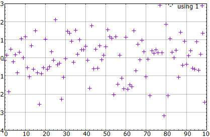
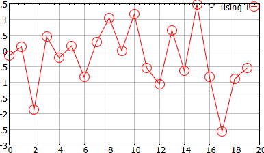

<!-- LC_NOTICE_BEGIN
===============================================================================
|                        Copyright (C) 2021 Luca Ciucci                       |
|-----------------------------------------------------------------------------|
| Important notices:                                                          |
|  - This work is distributed under the MIT license, feel free to use this    |
|   work as you wish.                                                         |
|  - Read the license file for further info.                                  |
| Written by Luca Ciucci <luca.ciucci99@gmail.com>, 2021                      |
===============================================================================
LC_NOTICE_END -->

# _Gnuplot++_ quick start

This is a quick start guide, for more detailed usage description, please read the [usage](usage.md) guide.

## Including _Gnuplot++_

The first step is to include gnuplot in your project. There are several ways to do this, the simplest is using CMake:
```cmake
find_package(gnuplotpp REQUIRED)
target_link_libraries(your_target_name PUBLIC gnuplotpp) # or PRIVATE
```
For other ways to use _Gnuplot++_ in your project, read the [Including](Including.md) guide.

At this point in your code you can type:
```c++
#include <gnuplotpp/gnuplotpp.hpp>

// gnuplotpp is in the lc namespace, this line is not really necessary
using namespace lc;
```

## Sending commands:

Let's first create a _Gnuplot++_ instance:
```c++
Gnuplotpp gp;
```
You can send commands to _Gnuplot_ in this way:
```c++
gp << "plot [-pi/2:pi] cos(x),-(sin(x) > sin(x+1) ? sin(x) : sin(x+1))" << std::endl;
```
and you can create more complex commands:
```c++
const auto cmd = R"ashffsd(
plot '-' pt 6 ps 5, '-' pt 3 ps 5
1
3
2
1
EOF
2
5
6
2
3
EOF
)ashffsd";
```

Remember that `gp << std::endl` pushes a `"\n"` and flushes the queue, this means it is the equivalent of _"pressing enter"_ on the keyboard in the Gnuplot terminal.

## Generating a plot
_Gnuplot++_ library provide simple ways to create plots from _C++_, the simplest form is:
```c++
Gnuplotpp gp;

// This creates a plot instance that contains all the necessary data to render the chart
auto myPlot = gnuplot.plot({ 1, 2, 3, 2 });

// actually renders the plot
gp.draw({ myPlot });
```

### Example

```c++
#include <iostream>
#include <random>
#include <vector>

#include <gnuplotpp/gnuplotpp.hpp>
using namespace lc;

int main(int argc, char** argv)
{
    // Create a gnuplot instance
    Gnuplotpp gp;

    // generate some random numbers
    std::default_random_engine engine;
    std::normal_distribution generator;
    std::vector<double> data;
    for (size_t i = 0; i < 100; i++)
        data.push_back(generator(engine));

    // create a plot
    auto myPlot = gp.plot(data);
    
    // draw the plot
    gp.draw({ myPlot });

    return 0;
}
```

This generates the following plot:



## Generating multiple plots

You can render multiple plots in this way:
```c++
auto myPlot1 = gp.plot(data1);
auto myPlot2 = gp.plot(data2);
gp.render({ myPlot1, myPlot2 });
```

## Changing the plot style

You can change the plot styles in this way:
```c++
// Marker type and size
Gnuplotpp::Marker marker;
marker.pointType = Gnuplotpp::PointType::Circle;
marker.pointSize = 2;

// Setting a line with red color
Gnuplotpp::LineStyle lineStyle;
lineStyle.lineColor = "red";

// create a plot
auto myPlot = gp.plot(
    // plot data
    data,
    // we set the plot options using named aggregate initializer
    {
        .lineStyle = lineStyle,
        .marker = marker
    }
);
gp.draw({ myPlot });
```



Example of generated output:
```c++
unset style line 50
set style line 50 lc "red" pt 6 ps 2
plot '-'  using 1 with linespoint ls 50
-0.146382
0.13453
-1.87138
0.46065
-0.214253
EOD
```

## Analyzing the output

You can see the generated gnuplot commands by substituting:
```c++
Gnuplotpp gp;
```
with
```c++
Gnuplotpp gp(std::ofstream("myfile.p"));
```
This would create a file named `myfile.p` with the generated gnuplot commands, for example:
```c++
plot '-' using 1 pt 1, '-' using 1 pt 1
-0.146382
0.13453
-1.87138
EOD

2.46065
1.78575
2.16371
EOD
```

You can run the generated output typing on the command line:
```sh
gnuplot --persist "myfile.p"
```