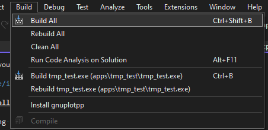

<!-- LC_NOTICE_BEGIN
===============================================================================
|                        Copyright (C) 2021 Luca Ciucci                       |
|-----------------------------------------------------------------------------|
| Important notices:                                                          |
|  - This work is distributed under the MIT license, feel free to use this    |
|   work as you wish.                                                         |
|  - Read the license file for further info.                                  |
| Written by Luca Ciucci <luca.ciucci99@gmail.com>, 2021                      |
===============================================================================
LC_NOTICE_END -->

# *Visual Studio* Tutorial

Using *VS* with *CMake* is a bit different story, please read this tutorial if you are going to use *VS*.

## Installing *Visual Studio*
Go to the [VS download page](https://visualstudio.microsoft.com/it/downloads/) and download the installer.

Follow the instructions and select (at least) the `C++ desktop development tools`, this includes CMake support:


## Opening the *Gnuplot++* project

Open VS and select *"Continue Without Code"*


Then select `File->Open->CMake...` and open the *Gnuplot++* folder:


## Manage configurations

VS support multiple configurations, you can change them:


You will see something like this:


You can change settings using the cmake variables table.

Now we need to set the install folder. Click on *Show advanced settings*:


Now set your favourite install location for libraries:


## Add the install folder to PATH

Add the following entries to the system PATH:
```
your_libraries_install_folder/lib
your_libraries_install_folder/lib/cmake
your_libraries_install_folder/bin
```

## Build the library:

To build the library, select `Build->Build All`:



## Install the library:

Select `Build->Install gnuplotpp`.


## Using the library from an external project

Create a new CMake project as described in [BuildAndInstall](BuildAndInstall.md), use the above steps to open the new project and you are ready to go!

Note that to run an executable target you can click the Run button, for example:

