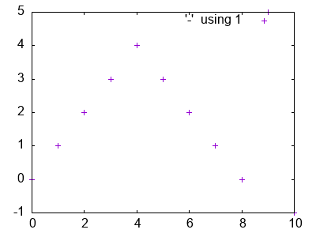
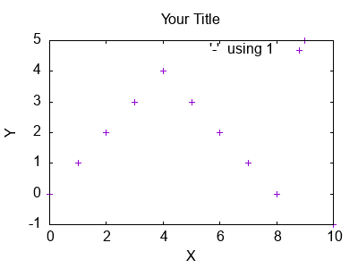
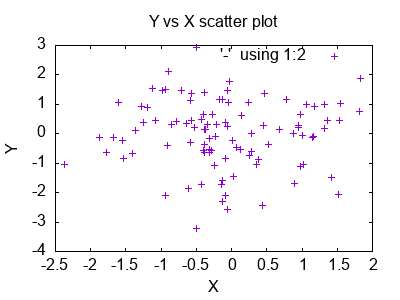
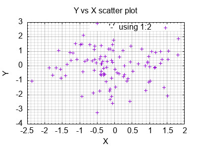
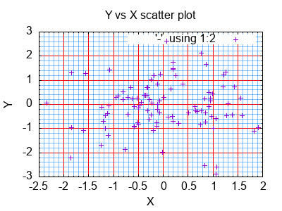
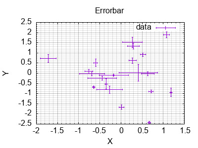
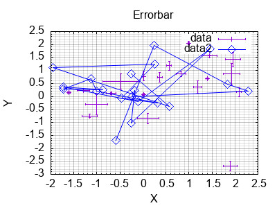
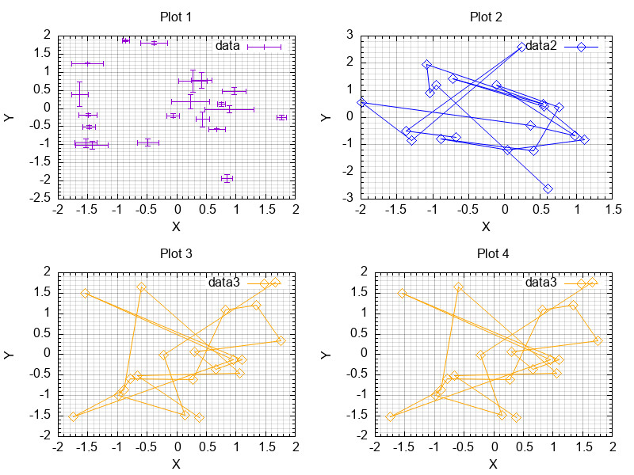
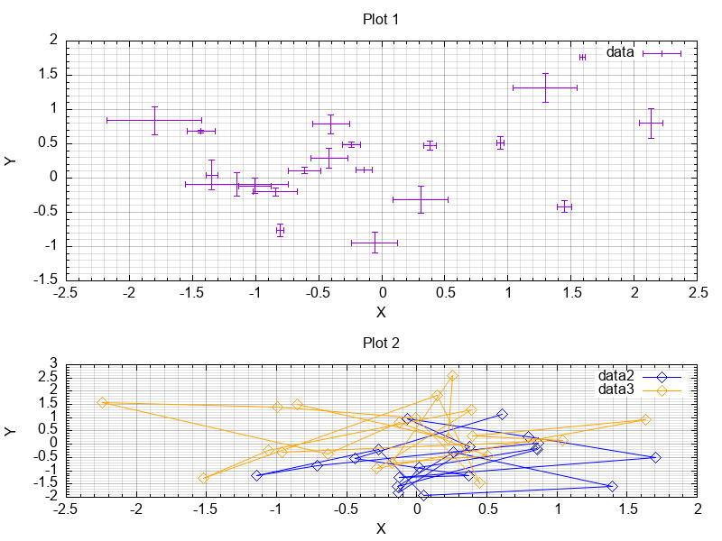

<!-- LC_NOTICE_BEGIN
===============================================================================
|                        Copyright (C) 2021 Luca Ciucci                       |
|-----------------------------------------------------------------------------|
| Important notices:                                                          |
|  - This work is distributed under the MIT license, feel free to use this    |
|   work as you wish.                                                         |
|  - Read the license file for further info.                                  |
| Written by Luca Ciucci <luca.ciucci99@gmail.com>, 2021                      |
===============================================================================
LC_NOTICE_END -->

# Detailed usage of the *Gnuplot++* library

 - [Introduction](#Introduction)
 - [Assumptions](#Assumptions)
 - [Basic plotting](#Basic-plotting)
   - [Basic plot structure](#Basic-plot-structure)
   - [Title and labels](#Title-and-labels)
   - [X and Y plot](#X-and-Y-plot)
 - [Plot Styles](#Plot-Styles)
   - [Grid](#Grid)
   - [Errorbar](#Errorbar)
   - [Overlapped plots](#Overlapped-plots)

## Introduction

## Assumptions

Let:
```cpp
Gnuplotpp gp;
```
and:
```cpp
std::default_random_engine e;
std::normal_distribution n;

// generates a random vector
auto randVec = [&](size_t N, double mean = 0.0, double sigma = 1.0) -> std::vector<double>
{
    std::vector<double> v; v.reserve(N);
    for (size_t i = 0; i < N; i++)
        v.push_back(n(e) * sigma + mean);
    return v;
};
```

## Basic plotting

### Basic plot structure

```cpp
// Creates a basic plot with the given data.
// Data is passed as a 'double' 'vector' altough any
// container of values convertible to 'double' is accepted
// (for example std::list<float>)
auto myPlot = gp.plot({ 0, 1, 2, 3, 4, 3, 2, 1, 0, 5, -1});

// draw the plot. In the curvy braces we write the list of plots to draw
gp.draw({ myPlot });
```


### Title and labels

```cpp
// ...

// Set plot title
gp.setTitle("Your Title");

// Set plot axes labels
gp.xLabel("X");
gp.yLabel("Y");

// You have to set title and labels before drawing!
gp.draw({ p });
```


To unset something, just call, for example, `gp.yLabel()` with no params.

### X and Y plot
```cpp
// Plot data with X and Y values
auto p = gp.plot(randVec(100), randVec(100));
gp.draw({ p });
```


## Plot Styles

### Grid

```cpp
// Enable majer and minor tics with the default values
gp.setTicksOptions(Gnuplotpp::TicksOptions{});

// Tells to plot both Major and Minor ticks
gp.setGridOptions(Gnuplotpp::GridOptions{ true, true });

gp.draw({ p });
```


#### Changing Grid Style
```cpp
// Ticks options
Gnuplotpp::TicksOptions ticks;
ticks.minorXdivider = ticks.minorYdivider = 3;
gp.setTicksOptions(Gnuplotpp::TicksOptions{});

// Create a line style for major ticks
Gnuplotpp::LineStyle majorLineStyle, minorLineStyle;
majorLineStyle.lineColor = "red";
minorLineStyle.lineColor = Gnuplotpp::Color{ 0, 128, 255, 128 }; // RGBA

// Tells to plot both Major and Minor ticks with different styles
Gnuplotpp::GridOptions options;
gp.setGridOptions(Gnuplotpp::GridOptions
    {
        .major = true,
        .minor = true,
        .majorLineStyle = majorLineStyle,
        .minorLineStyle = minorLineStyle
    }
);

gp.draw({ plot });
```


### Errorbar
```cpp
size_t N = 20;
auto plot = gp.errorbar(
    // Data
    {
        .y = randVec(N),
        .x = randVec(N),
        .yErr = randVec(N, 0, 0.2),
        .xErr = randVec(N, 0, 0.2)
    },
    // Plot options
    {
        .title = "data"
    }
);
gp.draw({ plot });
```



### Overlapped plots
```cpp
size_t N = 20;
auto plot1 = gp.errorbar(
    {
        .y = randVec(N),
        .x = randVec(N),
        .yErr = randVec(N, 0, 0.2),
        .xErr = randVec(N, 0, 0.2)
    },
    {
        .title = "data",
    }
);

Gnuplotpp::LineStyle lineStyle; lineStyle.lineColor = "blue";
Gnuplotpp::Marker marker; marker.pointType = Gnuplotpp::PointType::RhombusDot; marker.pointSize = 2;
auto plot2 = gp.plot(
    randVec(N),
    randVec(N),
    {
        .title = "data2",
        .lineStyle = lineStyle,
        .marker = marker
    }
);

// !!!
gp.draw({ plot1, plot2 });
```


### Multiplot
```cpp
if (auto multiplot = gp.multiplot(2, 2))
{
    gp.setTitle("Plot 1");
    gp.draw({ plot1 });
    gp.setTitle("Plot 2");
    gp.draw({ plot2 });
    gp.setTitle("Plot 3");
    gp.draw({ plot3 });
    gp.setTitle("Plot 4");
    gp.draw({ plot3 });
}
```


#### Changing sizes
```cpp
if (auto multiplot = gp.multiplot(2, 1))
{
    // plot 2 height (relative to 1)
    double h = 1 / 2.5;

    gp.setTitle("Plot 1");
    gp.setOrigin({ 0, h });
    gp.setSize({ 1, 1 - h });
    gp.draw({ plot1 });

    gp.setTitle("Plot 2");
    gp.setSize({ 1, h });
    gp.draw({ plot2, plot3 });
}
```


---
---
---
---
---
---
---
---
---
---
---
---
---
---
---
---
---
---
---
---
---
---